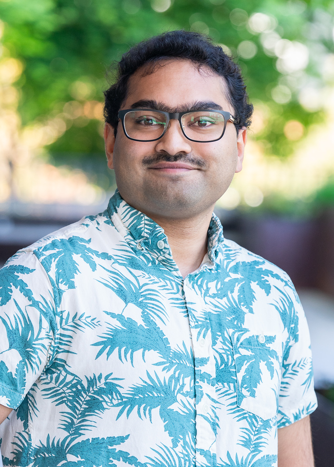

{.profile-photo}

## Bio

I am a first-year graduate student in the [Biomedical Engineering program](https://www.ohsu.edu/school-of-medicine/biomedical-engineering) at Oregon Health & Science University (OHSU), where I work in the lab of [Dr. Xubo Song](https://www.ohsu.edu/people/xubo-song-phd). My research sits at the intersection of machine learning and computational biology, with a current focus on multimodal single-cell data integration -- for example, jointly modeling scRNA-seq and scATAC-seq to translate between modalities and learn unified biological representations. I am also working on problems in hierarchical and equivariant representation learning and reinforcement learning applied to biological systems.

Before OHSU, I spent two years as an Aerospace Engineer at NASA Ames Research Center, where I built machine learning systems for real-time airport traffic and routing optimization, trained speech recognition models for air traffic control audio, and simulated electrified aircraft powertrain demonstrations using the National Airspace Digital Twin. I also conducted research at the UCSF Bone Quality Research Laboratory, developing CNN and transformer pipelines for automatic motion artifact grading of HR-pQCT scans and investigating how Type 2 Diabetes affects bone vascular structure and fracture risk.

I hold a B.S. in Electrical Engineering and Computer Science with Honors concentration in Molecular and Cellular Biology from UC Berkeley (Class of 2024).

Outside of research, I enjoy LEGO, gardening, cooking, bird watching, plane spotting, building drones, and 3D printing.

---

## Education

- **B.S. Electrical Engineering and Computer Science** *(Honors concentration in Molecular and Cellular Biology)*, UC Berkeley, 2024
- **M.S./Ph.D. Biomedical Engineering** *(in progress)*, OHSU, 2025-present

---

## Research Interests

- Multimodal single-cell omics
- Representation learning for biological data
- Reinforcement learning in biomedical contexts
- Computational imaging and deep learning for medical image analysis
- Explainability and interpretability in machine learning models for biology

---

## Skills and Tools

| Category | Tools |
|----------|-------|
| **ML / DL** | PyTorch, TensorFlow, Scikit-learn, CUDA |
| **Languages** | Python, R, Java, C, C++, Go |
| **Low-level / HW** | Verilog, RISC-V ISA, SolidWorks (CAD) |
| **Data and Viz** | tidyverse, ggplot2, Quarto, MATLAB, SQL |
| **Infra** | Git, Linux, all the essential tools |

---

## Contact

- **Email**: kolluri [at] ohsu.edu
- **GitHub**: [pranavkolluri](https://github.com/pranavkolluri)
