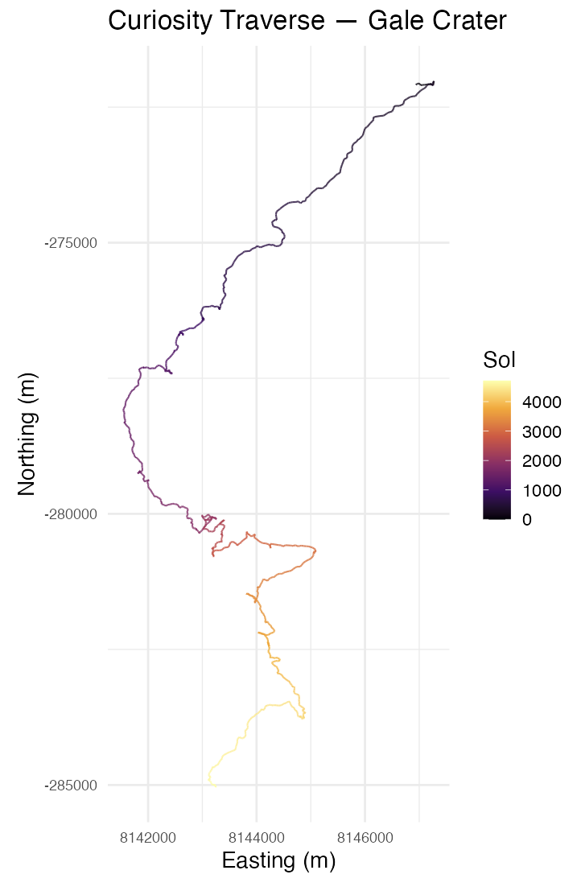
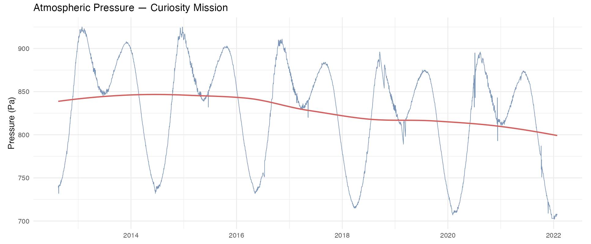

```{r setup, include=FALSE}
knitr::opts_chunk$set(echo = TRUE, message = FALSE, warning = FALSE)
```

## The App

<iframe src="https://pranavkolluri.github.io/bmi525_final_viz/"
        width="100%" height="650px"
        frameborder="0" allowfullscreen>
</iframe>

---

## The Data

The weather data comes from the Rover Environmental Monitoring Station (REMS), a suite of sensors on NASA's Curiosity rover that has been recording conditions in Gale Crater since landing in August 2012. The dataset used here was downloaded from [Kaggle](https://www.kaggle.com/datasets/deepcontractor/mars-rover-environmental-monitoring-station) and covers Sol 1 through Sol 3368 (approximately January 2022), spanning nearly 10 Earth years and five full Martian years.

{width=70% fig-align="center"}

Each row represents one Martian sol (day). Recorded variables include maximum and minimum air and ground temperature, atmospheric pressure, wind speed, humidity, and UV radiation index. Wind speed and humidity have substantial missing data due to sensor damage and power constraints throughout the mission. Air temperature and pressure are the most complete variables and are the focus of this visualization. Bizarrely, the weather variable is solely populated by "Sunny", and I haven't been able to figure out what precisely that variable is supposed to mean (it seems awfully coarse so it must have been derived from some combination of the other variables), so I have not included it in the visualization. The humidity and wind speed data were also Nulled out, so I was unable to add that information.

It's a bit unfortunate as the API that used to feed REMs data live appears to have failed at some point, and I can't find an alternative source for cached data from that API.

The rover's traverse path comes from the [MSL localized interpolated position dataset](https://an.rsl.wustl.edu/msl/AN/an3.aspx), derived from the NASA Planetary Data System, which records Curiosity's position in local Gale Crater coordinates at each drive.

{width=70% fig-align="center"}

---

## The Audience

The intended audience is any curious layperson with an interest in space or Mars exploration -- someone who knows generally what Curiosity is and what it does, and cares about what it has found, but has no background in planetary science or data analysis. The visualization is designed to be navigable without any prior knowledge of the data or the mission, with the traverse tab serving as an easy to use anchor before the more detailed information in time series tabs.

---

## Type of Chart

This visualization combines four chart types across its tabs:

| Tab | Chart type |
|-----|-----------|
| Traverse | Interactive map with colored path overlay (leaflet) |
| Temperature | Ribbon chart (min/max band over time) |
| Seasonal Patterns | Scatter plot with GAM smooth |
| Atmospheric Pressure | Line chart |

---

## Representation

Each tab tries to pose a different question about the data:

- **Traverse**: Where has Curiosity been, and how do conditions vary along that path? This is mostly an exploratory tab to get a sense of the data and the rover's journey.
- **Temperature**: How has temperature (and the daily temperature swing) changed over the 10-year mission?
- **Seasonal Patterns**: Does Mars have a consistent, repeating seasonal climate signal, and does it hold up across multiple Martian years? This tries to represent the seasonal cycle by plotting variables against solar longitude (LS), which is Mars's equivalent of a calendar position within the year.
- **Atmospheric Pressure**: Has atmospheric pressure drifted over the course of the mission, and what shape does the seasonal pressure cycle take?

---

## How to Read It

The traverse tab is the first that the view accesses, and is primarily designed as a visual way to navigate through all of the available data that is used later. It's fairly simple to read, as it consists of a map of Gale crater onto which waypoints from each sol are plotted. The color of the waypoints encodes either the sol number (mission progress) or a temperature variable, which can be toggled with the dropdown. The user can zoom and pan around the map to explore different areas of the traverse, and clicking on a waypoint will show a popup with the sol number and date, alongside all of the data recorded for that sol (max/min air temp, max/min ground temp, pressure, UV, weather, and elevation). 

The temperature tab allows the user to use the dropdown to select air or ground temperature. Selecting either yields a ribbon chart that shows the daily min/max range of that variable across the entire mission, with a midline showing the daily mean. This allows the user to see how the temperature and the daily temperature range have evolved over the course of the mission, and how they relate to each other.

The seasonal patterns tab plots each sol's value against solar longitude (LS, 0-360 degrees), which is Mars's equivalent of a calendar position within the year. Because multiple Martian years are overlaid, the repeating seasonal signal becomes more visible as a consistent pattern across the scatter. The variable dropdown offers max and min air temperature, max and min ground temperature, and atmospheric pressure. Ground temperature tends to show a more exaggerated seasonal swing than air temperature, since the surface heats and cools more directly with sun exposure than the thin atmosphere above it.

The atmospheric pressure tab shows the pressure readings across the entire mission as a line chart. While the yearly shape of the pressure readings are broadly similar, there's been a uniform lowering in pressure over the course of the mission. I suspect that this may have to do with the rover's traversal path having it moving to higher elevations over time, since pressure decreases with elevation, but I haven't done any specific work to verify that idea.

---

## Visual Design

The traverse tab uses the `inferno` palette from viridis, which is perceptually uniform and renders well in grayscale. The color encodes either mission progress (sol number) or a weather variable, giving a sense of where on the traverse different conditions were recorded.

The temperature and seasonal pattern tabs use a contrast-y two-color scheme: blue (#4e79a7) for the data and red (#e15759) for the smooth. The pressure tab uses the same blue for the raw line. The ribbon width in the temperature tab directly encodes the daily temperature range; a wide ribbon means a large swing between night and day.

The basemap is the NASA Viking MDIM21 colorized mosaic, served at up to zoom level 7 and stretched beyond that. It isn't the greatest resolution, but it at least gives the viewer a grander view of the landscape. I did attempt to find the Mars Reconnaissance Orbiter HiRISE tiles, which would have provided much higher resolution of the areas that Curiosity actually traversed, but I was unable to find those tiles in a format where a conversion to tiles was feasible without a lot of manual work. I still kind of want to do this in the future, but for now the Voyager tiles are good enough.

---

## How I Made It

### Data pipeline

```{mermaid}
flowchart LR
  A["REMS_Mars_Dataset.csv<br/>Kaggle"] --> C[clean_data.r]
  B["localized_interp.csv<br/>NASA PDS"] --> C
  C --> D[curiosity_rems_clean.csv]
  C --> E[curiosity_location_clean.csv]
  D --> F[app.r]
  E --> F
  F --> G[Shiny App]
```

### Cleaning

The raw REMS CSV has several formatting issues: dates are embedded in strings, missing values are the literal text "Value not available", and column names include special characters. The cleaning script handles all of this in a single tidyverse pipeline.

```{r clean-rems, eval=FALSE}
raw <- read_csv(
  "data/REMS_Mars_Dataset.csv",
  na = "Value not available",
  show_col_types = FALSE
)

clean <- raw %>%
  rename(
    max_ground_temp = `max_ground_temp(°C)`,
    min_ground_temp = `min_ground_temp(°C)`,
    max_air_temp = `max_air_temp(°C)`,
    min_air_temp = `min_air_temp(°C)`,
    pressure = `mean_pressure(Pa)`,
    wind_speed = `wind_speed(m/h)`,
    humidity = `humidity(%)`,
    uv = UV_Radiation
  ) %>%
  mutate(
    earth_date = as.Date(str_extract(earth_date_time, "\\d{4}-\\d{2}-\\d{2}")),
    mars_month = as.integer(str_extract(mars_date_time, "(?<=Month )\\d+")),
    ls = as.numeric(str_extract(mars_date_time, "(?<=LS )\\d+")),
    sol = as.integer(str_extract(sol_number, "\\d+"))
  ) %>%
  select(sol, earth_date, mars_month, ls, max_air_temp, min_air_temp,
         max_ground_temp, min_ground_temp, pressure, wind_speed, humidity,
         uv, weather, sunrise, sunset) %>%
  arrange(sol)
```

The location data is filtered to ROVER-frame records and reduced to one position per sol by taking the last recorded position of each sol.

```{r clean-location, eval=FALSE}
location <- read_csv("data/localized_interp.csv", show_col_types = FALSE) %>%
  filter(frame == "ROVER", sol >= 0) %>%
  group_by(sol) %>%
  slice_tail(n = 1) %>%
  ungroup() %>%
  select(sol, easting, northing, elevation,
         latitude = planetodetic_latitude, longitude) %>%
  arrange(sol)
```

### The app

The app is built with R Shiny and uses `leaflet` for the traverse map. The initial map render sets the CRS to `L.CRS.EPSG4326` to match the equirectangular projection of the NASA Trek tiles, and `maxNativeZoom = 7` tells leaflet to upscale the zoom-7 tiles rather than request tiles that do not exist at higher zoom levels. When this constraint is not set, leaflet will attempt and fail to fetch higher zoom tiles, so the user instead sees a blank map.

```{r app-map, eval=FALSE}
output$map <- renderLeaflet({
  leaflet(options = leafletOptions(crs = leafletCRS("L.CRS.EPSG4326"))) %>%
    addTiles(urlTemplate = mars_tiles, attribution = "NASA Mars Trek",
             options = tileOptions(maxNativeZoom = 7, maxZoom = 18)) %>%
    setView(lng = 137.4, lat = -4.6, zoom = 6) %>%
    addScaleBar(position = "bottomleft")
})
```

The traverse markers are updated reactively via `leafletProxy` when the color variable changes, so the basemap tiles are not re-fetched on each interaction.

The temperature ribbon uses `geom_ribbon` for the daily min/max band and a midline `geom_line` for the mean. The function dispatches on "air" or "ground" to select the right columns and color.

```{r app-temp, eval=FALSE}
makeTempPlot <- function(temp_type) {
  if (temp_type == "air") {
    dat <- weather %>%
      filter(!is.na(max_air_temp), !is.na(min_air_temp)) %>%
      mutate(lo = min_air_temp, hi = max_air_temp, mid = (lo + hi) / 2)
    col <- "#4e79a7"
    lbl <- "Air Temperature (°C)"
  } else {
    dat <- weather %>%
      filter(!is.na(max_ground_temp), !is.na(min_ground_temp)) %>%
      mutate(lo = min_ground_temp, hi = max_ground_temp, mid = (lo + hi) / 2)
    col <- "#e15759"
    lbl <- "Ground Temperature (°C)"
  }

  ggplot(dat, aes(x = earth_date)) +
    geom_ribbon(aes(ymin = lo, ymax = hi), fill = col, alpha = 0.4) +
    geom_line(aes(y = mid), color = col, linewidth = 0.3) +
    labs(title = paste(lbl, "Range -- Curiosity Mission"),
         x = NULL, y = lbl) +
    theme_minimal(base_size = 14)
}
```

The seasonal patterns tab plots all sols against solar longitude (LS, 0–360°), overlaying all Martian years so the repeating seasonal cycle is visible as a consistent pattern across the scatter. A GAM smooth with a cyclic cubic spline (`bs = "cc"`) is used rather than LOESS because the relationship between LS and temperature or pressure is periodic -- LOESS would produce a discontinuity at the 0°/360° seam where the seasons wrap.

```{r app-season, eval=FALSE}
makeSeasonPlot <- function(var) {
  lbl <- switch(var,
    "max_air_temp" = "Max Air Temp (°C)",
    "min_air_temp" = "Min Air Temp (°C)",
    "max_ground_temp" = "Max Ground Temp (°C)",
    "min_ground_temp" = "Min Ground Temp (°C)",
    "pressure" = "Pressure (Pa)"
  )

  dat <- weather %>%
    select(ls, y = all_of(var)) %>%
    filter(!is.na(ls), !is.na(y))

  ggplot(dat, aes(x = ls, y = y)) +
    geom_point(alpha = 0.25, size = 0.9, color = "#4e79a7") +
    geom_smooth(method = "gam",
                formula = y ~ s(x, bs = "cc", k = 20),
                se = FALSE, color = "#e15759", linewidth = 1) +
    scale_x_continuous(
      breaks = c(0, 90, 180, 270, 360),
      labels = c("0\n(N. Spring)", "90\n(N. Summer)",
                 "180\n(N. Autumn)", "270\n(N. Winter)", "360")
    ) +
    labs(title = paste(lbl, "by Solar Longitude"),
         subtitle = "All Mars years overlaid",
         x = "Solar Longitude (LS)", y = lbl) +
    theme_minimal(base_size = 14)
}
```

The atmospheric pressure tab is a simple line chart of pressure over the full mission with no smoothing overlay.

```{r app-pressure, eval=FALSE}
makePressurePlot <- function() {
  weather %>%
    filter(!is.na(pressure)) %>%
    ggplot(aes(x = earth_date, y = pressure)) +
    geom_line(color = "#4e79a7", linewidth = 0.4, alpha = 0.8) +
    labs(title = "Atmospheric Pressure -- Curiosity Mission",
         x = NULL, y = "Pressure (Pa)") +
    theme_minimal(base_size = 14)
}
```

The early versions of this visualization were effectively just the 3 other tabs, since I had the data for those. The traverse tab was originally a static ggplot: the rover's local Gale Crater coordinates (easting/northing) plotted as a colored path, with no basemap or interactivity.

::: {layout-nrow=2}
{fig-align="center" width=50%}

{fig-align="center"}
:::

I really wanted an interactive map, as I figured that it would lend a lot to the user experience; seeing the rover's path overlaid on actual Mars imagery is a bit more interesting. By some sheer luck, I managed to find position data that I could use to extrapolate the rover's location for every sol, which allowed me to replace the static plot with a leaflet map using the NASA Viking MDIM21 tile set. The map ended up being my favorite part of the project, and I think it really makes the visualization stand out. It also took considerably more work than expected: getting the correct CRS, understanding `maxNativeZoom`, and wiring up the clickable sol popups via `leafletProxy` all required a fair amount of trial and error. But I'm really happy with how it turned out!

The full source code (both `clean_data.r` and `app.r`) is available on [GitHub](https://github.com/pranavkolluri/bmi525_final_viz).
